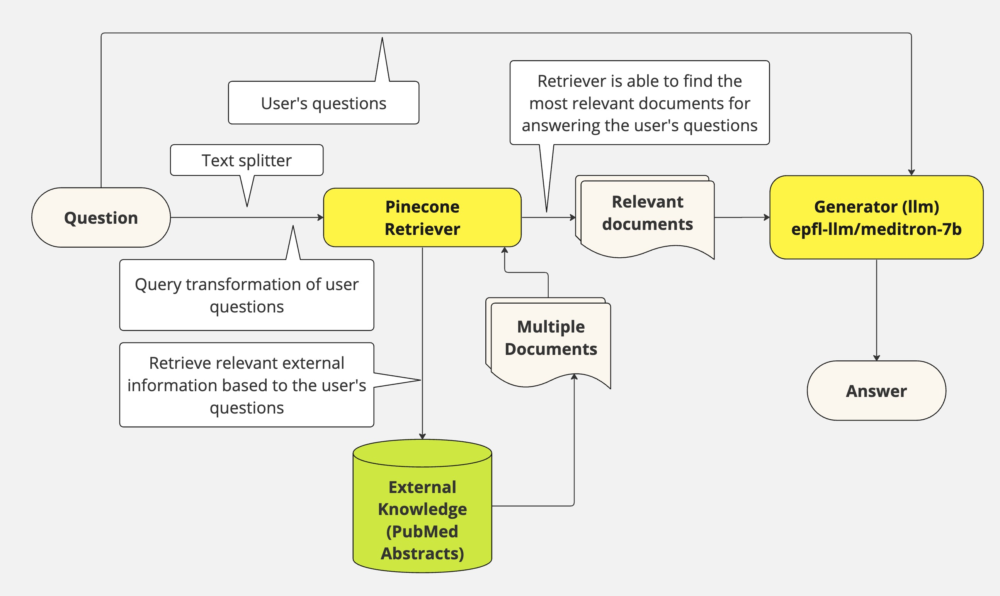

# Key Information

---

# ***Question Answering System for Medical Data using RAG***

---

### INLPT-WS2023 Group 33

---

## Team Members:

| Name                        | Matriculation Number | GitHub Username | Email Addresses                                                 |
|-----------------------------|----------------------|-----------------|-----------------------------------------------------------------|
| Karthik Thirthahalli Ganesh | 3770883              | karthikaf       | tgkarthik007@gmail.com, karthik@stud.uni-heidelberg.de          |
| Mohamed Mekki               | 4733974              | Mohamed-MEKKI   | mohamed.mekki@edu.ece.fr, mohamed.mekki@stud.uni-heidelberg.de  | 
| Raghav Kundra               | 4732299              | entunidotdeb    | raghavkundrasan@gmail.com, raghav.kundra@stud.uni-heidelberg.de |
| Waheb Zaidi                 | 3768236              | Zaldl           | zaidiwahebhasan@gmail.com, waheb.zaidi@stud.uni-heidelberg.de   | 

---

## Member Contribution:

**Karthik Thirthahalli Ganesh**: Complete Reporting Responsibilities, Data Acquisition, and Evaluation

**Mohamed Mekki**: Creating the RAG pipeline, setting up Pinecone configurations and database, configuring Retrievers, setting up Embedding and Chunking processes, and formatting the data.

**Raghav Kundra**: Data Acquisition from pubmed with their command line utility, Conversion of tsv data to JSON, Research on RAG and Suggested Meditron Model for text generation, Generation of dataset for evaluation (50 question-ground truth asnwers) from the PUBMED corpus, evaluate metrics and script

**Waheb Zaidi**: Discord Bot creation

---

## Advisor:

Nicolas Reuter (reuter@informatik.uni-heidelberg.de)

---

## Anti-plagiarism Confirmation:

We declare that what has been done in this project has been written by us 4 and that, with the exception of quotations,
no part has been copied from scientific publications, the Internet or from research works already presented in the
academic field by me or by other students.

In the case of parts taken from scientific publications, from the Internet or from other documents, I have expressly and
directly indicated the source at the end of the quotation or at the foot of the page.

I also declare that I have taken note of the sanctions provided for in case of plagiarism by the current Study
Regulations.

---

# Introduction

The explosion of digital information has created a double-edged sword. While vast knowledge is readily available,
sifting through mountains of text (research papers, articles, manuals, and databases) to find specific answers can be
incredibly time-consuming and frustrating.

This project tackles this challenge by developing a sophisticated question answering system. Imagine a system that
seamlessly interacts with you, understanding your questions and retrieving precise answers from a massive document
repository.

We use Langchain framework to efficiently splits text into manageable chunks and applies advanced Natural Language
Processing (NLP) techniques for analysis.

Pinecone acts as a powerful storage solution for high-dimensional data representations (embeddings) extracted from
documents, enabling efficient retrieval.

Once the RAG model identifies the relevant knowledge from the Pinecone vector store, Meditron takes over, refining and
generating the final answer in a clear and concise format.

This report delves into the architecture and key components of our QA system. You'll learn about the methodologies
employed, explore potential areas for improvement, and gain a comprehensive understanding of its effectiveness in
tackling text-based information retrieval challenges. Ultimately, you'll discover how this system empowers you to
navigate the information deluge and find the answers you seek efficiently.

---

# Related Work

`RAG with Transformers:` This [research](https://arxiv.org/pdf/2005.11401) investigates the effectiveness of employing
Transformer-based models for the encoder and decoder components within a RAG system. Transformers demonstrate strong
capabilities in learning complex relationships within text, potentially leading to improved response quality.

`Dense Passage Retrieval for RAG (DPR-RAG):` This [approach](https://aclanthology.org/2020.emnlp-main.550/) prioritizes
enhancing the initial retrieval step within a RAG system. It accomplishes this by integrating a pre-trained Dense
Passage Retriever (DPR) model. This model excels at pinpointing the most relevant passages from a massive knowledge
base. These identified passages are then fed into the generation stage. This two-step process significantly improves the
factual grounding and overall accuracy of the generated responses.

Inspired by the above works, our project aims to build a similar system, but with a focus on the medical domain. We plan
to leverage the Meditron and Pinecone to create a robust and efficient question-answering system. Our goal is to provide
accurate and reliable answers to medical questions by retrieving and analyzing relevant information from a large corpus
of medical literature.

---

# Methods / Approaches

The project uses the RAG model, which is a simple and effective way to build a question-answering system. It is based on
the use of a retriever (Pinecone), an answer generator (meditron), and a reader. The retriever is responsible for
finding the most relevant documents to the question. The answer generator is responsible for generating the answer to
the question. The reader is responsible for reading the documents and finding the answer to the question.


Diagram 1: RAG Pipeline of the Question Answering System of Our Project

`1. Pinecone vector database:` Our project incorporates [Pinecone](https://docs.pinecone.io/docs/overview), a
high-performance vector database. Pinecone excels at storing and searching for vector embeddings, which are numerical
representations of data commonly used in NLP applications. This allows us to perform efficient semantic searches,
retrieving similar content based on meaning rather than exact keywords. This capability is crucial for task like
question answering systems within our project. Pinecone seamlessly integrates with our development environment, offering
scalability for large datasets, robust security features, and a cloud-native architecture for effortless deployment.

`2. epfl-llm/meditron-7b:` Meditron is an open-source project offering a suite of medical Large Language Models (LLMs).
Among them, Meditron-7B stands out as a focused model with 7 billion parameters. This model is specifically adapted to
the medical domain by leveraging Llama-2-7B as a foundation. The adaptation process involves extensive pretraining on a
carefully curated medical corpus. This corpus incorporates valuable resources like selected PubMed articles and
abstracts, a [unique dataset](https://huggingface.co/datasets/epfl-llm/guidelines) of internationally recognized medical
guidelines, and general domain data
from [RedPajama-v1](https://huggingface.co/datasets/togethercomputer/RedPajama-Data-1T). Notably, when fine-tuned with
relevant medical training data, Meditron-7B demonstrates superior performance compared to its predecessors, Llama-2-7B
and PMC-Llama, on various medical reasoning tasks.

#### Model Details:

- `Developed by:` [EPFL LLM Team](https://huggingface.co/epfl-llm)
- `Model type:` Causal decoder-only transformer language model
- `Language(s):` English (mainly)
- `Model License:` [LLAMA 2 COMMUNITY LICENSE AGREEMENT](https://huggingface.co/meta-llama/Llama-2-70b/raw/main/LICENSE.txt)
- `Code License:` APACHE 2.0 LICENSE
- `Continue-pretrained from model:` [Llama-2-7B](https://huggingface.co/epfl-llm/meditron-7b)
- `Context length:` 2K tokens
- `Input:` Text-only data
- `Output:` Model generates text only
- `Status:` This is a static model trained on an offline dataset. Future versions of the tuned models will be released
  as we enhance model's performance.
- `Knowledge Cutoff:` August 2023

`3. Langchain:` We are using [Langchain](https://python.langchain.com/docs/get_started/introduction), a powerful NLP
platform that provides a wide range of tools and services for building and deploying NLP applications. Langchain offers
a variety of pre-trained models, including language models, translation models, and question answering models (Meditron,
in our project). It also provides tools for fine-tuning and customizing these models for specific tasks. Langchain is
designed to be easy to use, with a simple and intuitive interface that allows us to quickly build and deploy NLP
applications. It also offers robust security features, ensuring that our data and models are protected. Langchain is
available as a cloud-based service, making it easy to integrate into our development environment.

`4. Entrez Direct:` Entrez Direct for data retrival, a set of command-line tools for accessing the NCBI's Entrez
database. Entrez Direct provides a simple and efficient way to search for and retrieve data from the NCBI's vast
collection of biomedical literature. It allows us to perform complex queries, filter results, and retrieve specific
fields from the database.

---

# Experimental Setup and Results

### Data:

Our project focused on the medical domain, specifically targeting articles accessible through the `PubMed portal`. To
retrieve relevant data, we began by searching for abstracts containing the word "intelligence" published between 2013
and 2023. A helpful starting point was a link provided to us, which pointed to such abstracts
on [PubMed](https://pubmed.ncbi.nlm.nih.gov/?term=intelligence&filter=simsearch1.fha&filter=years.2013-2023) We were
then able to successfully acquire the data using `Entrez Direct utilities`, allowing us to search for and retrieve
information about these publications on intelligence.

Below is the main command which was used to retrieve the data:

```shell
esearch -db pubmed -query "(intelligence[Title/Abstract]) AND (("2013"[Date - Publication] : "2023"[Date - Publication]))" | efetch -format xml | xtract -pattern PubmedArticle -element MedlineCitation/PMID -block Abstract -sep " " -element AbstractText -block PubMedPubDate -if @PubStatus -equals "medline" -sep "/" -element Year,Month,Day -block Author -sep " " -tab ", " -element ForeName,LastName >> "$DIR/output.txt"
```

The retrieved documents from the portal then go through Chunker that helps process and split them into smaller chunks
for further processing.

```python
    def __init__(self, len_tokens_text):
    self.splitter = RecursiveCharacterTextSplitter(
        chunk_size=150,
        chunk_overlap=50,
        length_function=len_tokens_text,
        separators=['\n\n', '\n', ' ', '']
    )
```

```python
def splitter_function(self):
    return self.splitter


def chunk_text(self, text):
    return self.splitter.split_text(text)


def format_document(self, data_test):
    documents = []
    for doc in tqdm(data_test):
        author = doc['authors']
        date = doc['publication_date']
        uid = doc['PMID']
        chunks = self.chunk_text(doc['abstract'])
        for i, chunk in enumerate(chunks):
            documents.append({
                'id': f'{uid}-{i}',
                'text': chunk,
                'date': date,
                'authors': author
            })
    return documents
```

### Pinecone Vector Database:

Our project connects to Pinecone, a vector database, and stores text embeddings with metadata for efficient retrieval
and similarity search.

#### Key Methods followed:

`create_index(index_name):` Creates a new index in Pinecone with given specifications.

```python
    def create_index(self, index_name):


# get list of existing indexes
existing_indexes = [
    index_info["name"] for index_info in self.pinecone.list_indexes()
]

# check if index already exists (it shouldn't if this is first time)
if index_name not in existing_indexes:
    # if does not exist, create index
    self.pinecone.create_index(
        index_name,
        dimension=768,  # dimensionality of minilm
        metric='cosine',
        spec=pinecone.PodSpec(environment='us-central1-gcp')
    )
    # wait for index to be initialized
    while not pinecone.describe_index(index_name).status['ready']:
        time.sleep(1)
    # create index
    index_name = "project-qa"
log.info(f"Index {index_name} created")
return self.pinecone.Index(index_name)
```

`delete_index(index_name):` Deletes an existing index from Pinecone.

```python
    def delete_index(self, index_name):
    self.pinecone.delete_index(index_name)
    log.info(f"Index {index_name} deleted")
```

`show_stats(index_name):` Displays statistics about an existing index.

```python
    def show_stats(self, index_name):
    self.pinecone_index = self.pinecone.Index(index_name)
    self.pinecone_index.describe_index_stats()
```

`store_embeddings(dataset):`

- Processes a dataset in batches.
- Generates text embeddings using the Embeddings class.
- Extracts metadata for each text entry.
- Stores embeddings, metadata, and unique IDs in the Pinecone index.

```python
    def store_embeddings(self, dataset):
    batch_size = 32
    # to be changed according to our data final shape

    for i in tqdm(range(0, len(dataset), batch_size)):
        i_end = min(len(dataset), i + batch_size)
        batch = dataset.iloc[i:i_end]
        ids = [f"{x['id']}" for i, x in batch.iterrows()]
        texts = [x['text'] for i, x in batch.iterrows()]
        embeds = self.embeddings.embed_documents(texts)
        # get metadata to store in Pinecone
        metadata = [
            {'text': x['text'],
             'authors': x['authors']} for i, x in batch.iterrows()
        ]
        print(metadata)
        self.pinecone_index.upsert(vectors=zip(ids, embeds, metadata))
```

### Query Transformation:

We have used query transformation to `generate_prompt` that takes a user question returns a transformed, more general question.

We have followed the steps below in the `generate_prompt` function:
- List of examples are passed where a specific question is transformed into a more generic one.
- For example, "Could the members of The Police perform lawful arrests?" is transformed to "what can the members of The Police do?".
These examples help the meditron to understand the transformation process.

Prompt Construction:
- It builds a template for a conversation between a human and the AI using the ChatPromptTemplate class.
The conversation shows the human asking the specific question and the AI responding with the transformed question.
This template serves as a guide for the AI to learn the transformation process.

User Question Integration:
- It adds the user's actual question to the conversation template, allowing the AI to transform it based on the learned examples.

AI Integration and Output:
- We use ChatOpenAI class to interact with an OpenAI API.
- The conversation template with the user's question is fed to the AI.
- The AI, guided by the examples and the conversation format, generates the transformed question.
- Finally, a text parser extracts the transformed question from the AI's response.

```python
def generate_prompt(question, api_key):
    # Few Shot Examples
    examples = [
        {
            "input": "Could the members of The Police perform lawful arrests?",
            "output": "what can the members of The Police do?",
        },
        {
            "input": "Jan Sindel’s was born in what country?",
            "output": "what is Jan Sindel’s personal history?",
        },
    ]
    # We now transform these to example messages
    example_prompt = ChatPromptTemplate.from_messages(
        [
            ("human", "{input}"),
            ("ai", "{output}"),
        ]
    )
    few_shot_prompt = FewShotChatMessagePromptTemplate(
        example_prompt=example_prompt,
        examples=examples,
    )
    prompt = ChatPromptTemplate.from_messages(
        [
            (
                "system",
                """You are an expert at world knowledge. Your task is to step back and paraphrase a question to a more generic step-back question, which is easier to answer. Here are a few examples:""",
            ),
            # Few shot examples
            few_shot_prompt,
            # New question
            ("user", "{question}"),
        ]
    )
    question_gen = prompt | ChatOpenAI(temperature=0,
                                       openai_api_key=api_key ) | StrOutputParser()
    new_question = question_gen.invoke({"question": question})
    return new_question
```

### RAG pipeline:

Below is the explanation of the RAG and its methods and how we used it.

`rag_pipeline(self, retriever):`

- This is the core method for building the simple RAG pipeline.
    - It defines a PromptTemplate with specific instructions:
        - Use provided context for answering the question.
        - Answer concisely (maximum 3 sentences).
        - Acknowledge the user with "thanks for asking!".
    - It constructs a processing chain using langchain functionalities:
        - Access context from the provided retriever (assumed to return documents) and format it using format_docs.
        - Pass the user's question through a RunnablePassthrough (likely keeps the question unchanged).
        - Apply the `custom_rag_prompt` to format the context and question for the LLM model.
        - Utilize the `self.model.meditron()` method to generate an answer using the LLM.
        - Parse the final output from the LLM model as a string using `StrOutputParser`.

```python
    def rag_pipeline(self, retriever):
    template = """Use the following pieces of context to answer the question at the end.
        If you don't know the answer, just say that you don't know, don't try to make up an answer.
        Use three sentences maximum and keep the answer as concise as possible.
        Always say "thanks for asking!" at the end of the answer.

        {context}

        Question: {question}

        Helpful Answer:"""
    custom_rag_prompt = PromptTemplate.from_template(template)

    rag_chain = (
            {"context": retriever | format_docs, "question": RunnablePassthrough()}
            | custom_rag_prompt
            | self.model.meditron()
            | StrOutputParser()
    )

    return rag_chain
```

### Compression Retriever:

This retriever considers contextual relevance during retrieval, leading to more accurate results.
Also, prioritizes condensed information, providing concise and informative responses. Reduced redundancy is achieved
through this.

```python
    def reranker_retrieval(self, llm, k: int):
    compressor = LLMChainExtractor.from_llm(llm)

    compression_retriever = ContextualCompressionRetriever(
        base_compressor=compressor, base_retriever=self.ensemble_retriever(k)
    )
    return compression_retriever
```

Key steps followed in the above function:

- `Creates a compressor:` It extracts relevant information from text inputs using the `document_compressors`.
- `Integrates with base retrieval:` It combines the compressor with an ensemble retriever to prioritize those with the
  most condensed and relevant information.
- `Returns a combined retriever:` This `compression_retriever` can be used to retrieve information that's relevant to a
  query.

```python
    compression_retriever = retriever.reranker_retrieval(meditron_model.meditron(), k=3)
```

- Creates a compression retriever for enhanced retrieval.
- Leverages the Meditron for compression and context-aware retrieval.
- Sets k=3, instructing the base retriever to initially retrieve 3 candidate documents.

### Filtering:

Below function defines the method for filtering retrieved documents using the ensemble retriever and an embedding model.

```python
    def filter_retrieval(self, emb_model, ensemble_retriever, splitter):
    from langchain.retrievers.document_compressors import EmbeddingsFilter

    embeddings_filter = EmbeddingsFilter(embeddings=emb_model, similarity_threshold=0.5)

    compression_retriever = ContextualCompressionRetriever(
        base_compressor=embeddings_filter, base_retriever=ensemble_retriever
    )

    from langchain.retrievers.document_compressors import DocumentCompressorPipeline
    from langchain_community.document_transformers import EmbeddingsRedundantFilter

    redundant_filter = EmbeddingsRedundantFilter(embeddings=emb_model)
    relevant_filter = EmbeddingsFilter(embeddings=emb_model, similarity_threshold=0.50)
    pipeline_compressor = DocumentCompressorPipeline(
        transformers=[splitter, redundant_filter, relevant_filter]
    )
    filter_retrieval = ContextualCompressionRetriever(
        base_compressor=pipeline_compressor, base_retriever=ensemble_retriever
    )

    return filter_retrieval
```

Key steps followed in the above function:

Embeddings Filter:

- An `EmbeddingsFilter` object is created using the provided `emb_model` to generate text embeddings.
- It sets a `similarity_threshold` of `0.5`, which will be used for filtering based on embedding similarity.

Contextual Compression Retriever:

- A `ContextualCompressionRetriever` is created, similar to `reranker_retrieval`.
- This time, the base compressor is the `embeddings_filter`, ensuring retrieved documents have similar embeddings to the
  query.

And then it is called in the `main.py` function:

```python
 filter = retriever.filter_retrieval(emb_model=emb.embed_model(), splitter=chunker.splitter_function(),
                                     ensemble_retriever=ensemble_retriever)
```

### Retrieval Methods:

`vectorstore_retriever(self, k: int):`

- Creates a document retriever directly from the vector store.
- The k parameter specifies the number of most relevant documents to retrieve for a query.

```python
    def vectorstore_retriever(self, k: int):
        return self.vectorstore.as_retriever(search_kwargs={"k": k})
```

`bm25_retriever(self, k: int):`
- Constructs a BM25 retriever based on the text content within the dataset. 
- BM25 is a popular retrieval method that assigns relevance scores to documents based on keyword frequency.
- The k parameter again sets the number of documents to retrieve.

```python
    def bm25_retriever(self, k: int):
        return BM25Retriever.from_texts(list(self.dataset["text"]), k=k)
```

`bm25_doc_search(self, query: str, k: int):`
- Utilizes the previously created BM25 retriever to search for documents relevant to a specific query (string).
- It retrieves the k most relevant documents based on the BM25 scoring.

```python
    def bm25_doc_search(self, query, k: int):
        return self.bm25_retriever(k).get_relevant_documents(query)
```

`ensemble_retriever(self, k: int):`
- Defines an ensemble retriever that combines multiple retrieval strategies.
- It combines the `bm25_retriever` and `vectorstore_retriever` with equal weights (0.5 each). This allows the system to leverage both BM25's text-based relevance and the vector store's potentially more nuanced similarity search capabilities.

```python
    def ensemble_retriever(self, k: int):
        return EnsembleRetriever(
            retrievers=[self.bm25_retriever(k), self.vectorstore_retriever(k)], weights=[0.5, 0.5])
```

`doc_search(self, query: str, k: int):`
- This is our primary document search method.
- It directly interacts with the vectorstore to perform a similarity search based on the provided query.
- The k parameter specifies the number of most similar document chunks to return.

```python
    def doc_search(self, query: str, k: int):
        return self.vectorstore.similarity_search(
            k=k,  # returns top k most relevant chunks of text
            query=query,  # the search query
        )
```

###

### meditron-7b:

Our project uses the meditron-7b model to generate answers to medical questions. The model is loaded using the Hugging
Face Transformers library. The model is then fine-tuned on the medical dataset to improve its performance on medical
question-answering tasks.

#### Key Methods followed in the Meditron class:

`__init__(self, model_id: str, access_token: str)`:
Initializes the class by loading the tokenizer and model from the specified model_id.
Optionally uses an access_token for private model access.

```python
    def __init__(self, model_id: str, access_token: str):
    # Load tokenizer and model
    self.tokenizer = AutoTokenizer.from_pretrained(model_id, use_auth_token=access_token)
    self.model_config = AutoConfig.from_pretrained(
        model_id, use_auth_token=access_token
    )
    self.model = AutoModelForCausalLM.from_pretrained(
        model_id,
        trust_remote_code=True,
        config=self.model_config,
        device_map='auto',
        use_auth_token=access_token
    )
```

`model_eval(self):`
Sets the model to evaluation mode (disables dropout layers for better inference).

```python
    def model_eval(self):
    self.model.eval()
```

`get_memory_footprint(self):`
Prints the memory footprint of the loaded model, helpful for resource management.

```python
    def get_memory_footprint(self):
    print(self.model.get_memory_footprint())
```

`len_tokens_text(self, text: str):`
Calculates the number of tokens a text string gets divided into after tokenization.
Useful for tasks that consider token length. (Currently prints the tokenized output for debugging purposes).

```python
    def len_tokens_text(self, text):
    # tokenize the text
    tokens = self.tokenizer.encode(text)
    print(tokens)
    return (len(tokens))
```

`text_generation_pipeline(self):`
Creates a pipeline specifically for text generation using the loaded model and tokenizer.
Configures parameters like temperature, maximum new tokens, and repetition penalty for text generation quality.

```python
    def text_generation_pipeline(self):
    text_gen_pipeline = pipeline(
        model=self.model, tokenizer=self.tokenizer,
        return_full_text=True,
        task='text-generation',
        temperature=0.01,
        max_new_tokens=512,
        repetition_penalty=1.1
    )
    return text_gen_pipeline
```

### Advanced RAG Techniques:

- Query transformation is one of the advanced technique that can significantly improve the accuracy of the results which we have used in our project.
- below is the function call in the `main.py` of the query transformation.

```python
    #question format
    new_question = generate_prompt(question, openai_api_key)
```

- Ensemble Retriever is another advanced technique that we have used in our project. It combines `self.bm25_retriever(k)` and `self.vectorstore_retriever(k)` to improve the accuracy of the results.

- Compression Retriever compresses the retrieved documents to provide more concise and informative responses.

- Filtering is used to filter the retrieved documents using the ensemble retriever and an embedding model.

- Hybrid search combines the ensemble retriever and the meditron model to improve the accuracy.

Collectively, these advanced techniques significantly enhance the performance of our question-answering system.

```python
    ##Ensemble Retriever
    ####################
    ensemble_retriever = retriever.ensemble_retriever(3)

    ##Compression Retriever
    ####################
    compression_retriever=retriever.reranker_retrieval(meditron_model.meditron(), k=3)

    #Filter
    ####################
    filter = retriever.filter_retrieval(emb_model=emb.embed_model(), splitter=chunker.splitter_function(), ensemble_retriever=ensemble_retriever)

    #Initiate different pipelines
    ####################    

    #simple retriever
    simple_rag = rag_pipeline(pinecone_retriever, meditron_model.meditron()).invoke(new_question)

    #Hybird search
    advanced_rag = rag_pipeline(ensemble_retriever, meditron_model.meditron()).invoke(new_question)

    #Reranking
    advanced_rag_compression = rag_pipeline(compression_retriever, meditron_model.meditron()).invoke(new_question)

    #Reranking + filtering
    advanced_rag_compression_with_filter = rag_pipeline(filter, meditron_model.meditron()).invoke(new_question)
    
    return simple_rag, advanced_rag, advanced_rag_compression, advanced_rag_compression_with_filter
```

---

## Evaluation:

`Evaluation Metrics:` We evaluated the performance of our Retrieval-Augmented Generation (RAG) model with GPT-3 using automatic metrics.

### RAG with GPT-3 Performance:

- `BLEU Score:` 0.1366. BLEU score measures similarity between generated text and reference text. Our score suggests there is room for improvement in how closely the generated text matches the reference text.

```python
{'bleu': 0.13661000332472145, 'precisions': [0.2511013215859031, 0.1481981981981982, 0.10783410138248847, 0.08679245283018867], 'brevity_penalty': 1.0, 'length_ratio': 2.483588621444201, 'translation_length': 2270, 'reference_length': 914}
```

- `ROUGE Scores:` We measured ROUGE scores (ROUGE-1, ROUGE-2, ROUGE-L, ROUGE-Lsum) which focus on n-gram overlap between generated text and reference text.
  * Scores ranged from 0.22 to 0.35, indicating a moderate level of overlap between the generated text and the reference text.

```python
{'rouge1': 0.35399795189250194, 'rouge2': 0.22953877971335324, 'rougeL': 0.3249628682286886, 'rougeLsum': 0.3249125370795783}
```

- `Length Ratio:` The generated text was on average 2.48 times longer than the reference text.

- `Comparison with Simple System:` We also evaluated a simpler retrieval-based system. This system achieved a high F1 score (0.889) indicating `strong precision` and recall for retrieving relevant information.

- `BERT Score`

```python
{'precision': 0.8641319072246552, 'recall': 0.9162256932258606, 'f1': 0.8891923761367798}
```

### Overall Interpretation:

- While the RAG with GPT-3 model shows some promise in generating text relevant to the reference, we can improve the model's ability to closely replicate the reference text while being more concise. 
- The simpler retrieval-based system achieved good performance, suggesting further exploration is needed to understand the trade-offs between complexity and effectiveness.

---

## Results:

Advancements in our Question Answering (QA) system leverage the Retrieval Augmented Generation model to improve
efficiency. RAG incorporates chunked summaries of relevant documents (abstracts) during response generation. This
approach injects contextual information into the response process, allowing the QA system to produce more accurate and
relevant answers to user queries. This technique exemplifies the benefits of retrieval-augmented methods, demonstrating
that strategically incorporating focused snippets of information can significantly enhance the performance of large
language models (LLMs) in intricate QA tasks.

---

# Conclusion

Our project demonstrates the effectiveness of combining a Retrieval Augmented Generation (RAG) model with a pre-trained
large language model (MEDITRON-7B) for efficient medical question answering. This approach leverages cutting-edge
techniques while tailoring them to the specific requirements of retrieving medical information.

### Future Directions:

`Staying updated:` We plan to keep pace with advancements in Langchain, open-source LLMs, and Pinecone vector storage to
continuously improve our system.

`Iterative refinement:` We prioritize the continuous evaluation of the Langchain RAG model on evolving medical datasets.
Experimenting with various embedding models may further enhance our system's accuracy.

`User-centric approach:` We will actively incorporate user feedback to guide iterative improvements and ensure the
system remains intuitive and user-friendly.

---

# References

1. `Title:` MEDITRON-7B: Scaling Medical Pretraining for Large Language Models [arXiv:2311.16079] (cs.CL).

   `Authors:` Zeming Chen, Alejandro Hernández-Cano, Angelika Romanou, Antoine Bonnet, Kyle Matoba, Francesco Salvi,
   Matteo Pagliardini, Simin Fan, Andreas Köpf, Amirkeivan Mohtashami, Alexandre Sallinen, Alireza Sakhaeirad, Vinitra
   Swamy, Igor Krawczuk, Deniz Bayazit, Axel Marmet, Syrielle Montariol, Mary-Anne Hartley, Martin Jaggi and Antoine
   Bosselut.

   `Year:` November, 2023.

   `url:` [meditron GitHub repository](https://github.com/epfLLM/meditron)

2. [Langchain documentation](https://python.langchain.com/docs/get_started/introduction)

3. [Entrez Direct: E-utilities on the Unix Command Line](https://www.ncbi.nlm.nih.gov/books/NBK179288/)

4. [Pinecone Documentation](https://docs.pinecone.io/docs/overview)

5. [Dense Passage Retrieval for Open-Domain Question Answering](https://aclanthology.org/2020.emnlp-main.550) (Karpukhin
   et al., EMNLP 2020)


